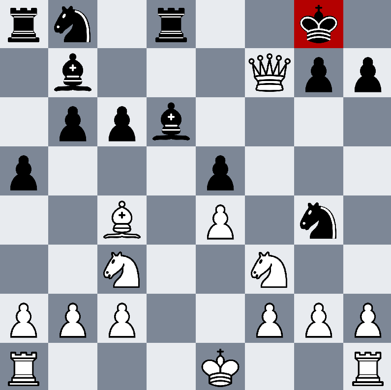

# Chess

<!-- start -->
<p align="middle">
	
</p>
<!-- end -->

A simple C++ chess game.

## Installation
### Prerequisites
This project uses the SMFL library (2.5.1), it should be installed before compiling the project (see [this link](https://www.sfml-dev.org/tutorials/2.5/)). This project has only been tested for Linux for now.

### Compiling the project
__TODO__

## Usage
To launch a chess game, just launch the generated executable:
```shell
./build/chess
```

The escape key can be used to exit the program

## Credits
* Lichess project (Thibault Duplessis) - sounds